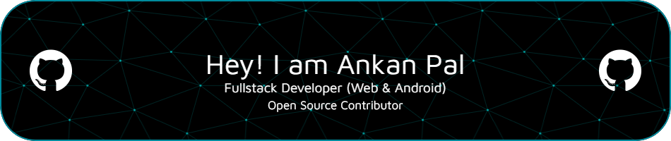

<div align="center">



[](https://github.com/itsyourap)

<p>
  
  
  
</p>

</div>

---

## 💡 About Me

I design and build resilient systems — from Kubernetes clusters and CI/CD pipelines to scalable backend services and polished web interfaces.

- 🏢 **DevOps Engineer & Full-Stack Developer** at [ProjectX.Cloud (YC P26)](https://projectx.cloud) *(since March 2024)*
- 🌍 Based in **West Bengal, India**
- 🤝 Open to collaborating on **Open Source Projects**
- ✉️ [contact@itsyourap.dev](mailto:contact@itsyourap.dev) · 🌐 [itsyourap.dev](https://itsyourap.dev/)

<br />

[](https://holopin.io/@itsyourap)

---

## 💻 Tech Stack

**Languages**

<p>
  
</p>

**DevOps & Cloud**

<p>
  
</p>

**Frontend**

<p>
  
</p>

**Backend & Databases**

<p>
  
</p>

---

## 🚀 Featured Projects

| Project | Description | Tech |
| --- | --- | --- |
| [**RTSP Human Capture**](https://github.com/itsyourap/rtsp-human-capture) | Real-time person detection CLI from RTSP camera streams · [Docs](https://rtsp-human-capture.docs.itsyourap.dev/) | Python, YOLOv4, OpenCV |

---

## 🔗 Connect With Me

<p align="left">
  <a href="https://linkedin.com/in/itsyourap" target="_blank"></a>&ensp;
  <a href="https://x.com/itsyourap" target="_blank"></a>&ensp;
  <a href="https://instagram.com/itsyourap" target="_blank"></a>&ensp;
  <a href="https://dev.to/itsyourap" target="_blank"></a>&ensp;
  <a href="https://medium.com/@itsyourap" target="_blank"></a>
</p>
<p align="left">
  <a href="https://stackoverflow.com/users/17178385" target="_blank"></a>&ensp;
  <a href="https://www.leetcode.com/itsyourap" target="_blank"></a>&ensp;
  <a href="https://auth.geeksforgeeks.org/user/itsyourap" target="_blank"></a>&ensp;
  <a href="https://itsyourap.dev/" target="_blank"></a>
</p>

---

## 📊 GitHub Stats

<p align="center">
  <a href="#"></a>
  <a href="#"></a>
</p>

<p align="center">
  <a href="#"></a>
</p>

## 🏆 GitHub Trophies

<p align="center">
  <a href="https://github.com/ryo-ma/github-profile-trophy"></a>
</p>

---

## 🔄 Recent Activities

<!--START_SECTION:activity-->
1. 🔒 Closed issue [#13](https://github.com/JFC-Group/JFC-microsip/issues/13) in [JFC-Group/JFC-microsip](https://github.com/JFC-Group/JFC-microsip)
2. 🔒 Closed issue [#35](https://github.com/Team-ByteWise/EcoNFT/issues/35) in [Team-ByteWise/EcoNFT](https://github.com/Team-ByteWise/EcoNFT)
3. 🔒 Closed issue [#36](https://github.com/Team-ByteWise/EcoNFT/issues/36) in [Team-ByteWise/EcoNFT](https://github.com/Team-ByteWise/EcoNFT)
4. ❌ Closed PR [#39](https://github.com/Team-ByteWise/EcoNFT/pull/39) in [Team-ByteWise/EcoNFT](https://github.com/Team-ByteWise/EcoNFT)
5. ❌ Closed PR [#38](https://github.com/Team-ByteWise/EcoNFT/pull/38) in [Team-ByteWise/EcoNFT](https://github.com/Team-ByteWise/EcoNFT)
<!--END_SECTION:activity-->

---

## ⏱️ WakaTime Stats

<!--START_SECTION:waka-->


**🐱 My GitHub Data** 

> 📦 4.0 MB Used in GitHub's Storage 
 > 
> 🏆 822 Contributions in the Year 2026
 > 
> 🚫 Not Opted to Hire
 > 
> 📜 28 Public Repositories 
 > 
> 🔑 114 Private Repositories 
 > 
**I'm an Early 🐤** 

```text
🌞 Morning                2320 commits        ███████░░░░░░░░░░░░░░░░░░   26.81 % 
🌆 Daytime                2044 commits        ██████░░░░░░░░░░░░░░░░░░░   23.62 % 
🌃 Evening                3834 commits        ███████████░░░░░░░░░░░░░░   44.30 % 
🌙 Night                  456 commits         █░░░░░░░░░░░░░░░░░░░░░░░░   05.27 % 
```
📅 **I'm Most Productive on Sunday** 

```text
Monday                   974 commits         ███░░░░░░░░░░░░░░░░░░░░░░   11.25 % 
Tuesday                  888 commits         ███░░░░░░░░░░░░░░░░░░░░░░   10.26 % 
Wednesday                945 commits         ███░░░░░░░░░░░░░░░░░░░░░░   10.92 % 
Thursday                 1342 commits        ████░░░░░░░░░░░░░░░░░░░░░   15.51 % 
Friday                   1461 commits        ████░░░░░░░░░░░░░░░░░░░░░   16.88 % 
Saturday                 1484 commits        ████░░░░░░░░░░░░░░░░░░░░░   17.15 % 
Sunday                   1560 commits        █████░░░░░░░░░░░░░░░░░░░░   18.03 % 
```


📊 **This Week I Spent My Time On** 

```text
🕑︎ Time Zone: Asia/Kolkata

💬 Programming Languages: 
Terraform                3 hrs 14 mins       ███████████████░░░░░░░░░░   59.15 % 
YAML                     1 hr 22 mins        ██████░░░░░░░░░░░░░░░░░░░   25.22 % 
JavaScript               31 mins             ██░░░░░░░░░░░░░░░░░░░░░░░   09.53 % 
Python                   11 mins             █░░░░░░░░░░░░░░░░░░░░░░░░   03.48 % 
Other                    5 mins              ░░░░░░░░░░░░░░░░░░░░░░░░░   01.78 % 

🔥 Editors: 
VS Code                  5 hrs 22 mins       █████████████████████████   98.23 % 
Unknown Editor           5 mins              ░░░░░░░░░░░░░░░░░░░░░░░░░   01.77 % 
```

**I Mostly Code in Shell** 

```text
Shell                    76 repos            █████████░░░░░░░░░░░░░░░░   34.08 % 
TypeScript               35 repos            ████░░░░░░░░░░░░░░░░░░░░░   15.70 % 
JavaScript               11 repos            █░░░░░░░░░░░░░░░░░░░░░░░░   04.93 % 
Go                       10 repos            █░░░░░░░░░░░░░░░░░░░░░░░░   04.48 % 
Astro                    1 repo              ░░░░░░░░░░░░░░░░░░░░░░░░░   00.45 % 
```


**Timeline**


 Last Updated on 04/04/2026 19:29:37 UTC
<!--END_SECTION:waka-->

---

## 💵 Sponsor My Work

<a href="https://www.buymeacoffee.com/itsyourap" target="_blank"></a>


