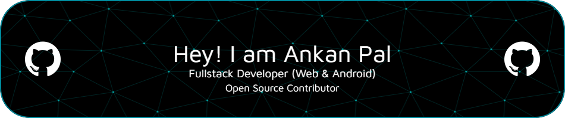

## I am a First Year student studying B.Tech in CSE, having a keen interest in contributing to Open Source and developing Android & Web Apps.

I've been learning to code since the last 6 years, started my journey by learning Java as my first programming language and then learnt so many new languages such as Python, PHP, Lua, etc..

- 🌍 I'm based in West Bengal, India
- ✉️ You can contact me at [itsyourap@gmail.com](mailto:itsyourap@gmail.com)
- 🧠 I'm learning TypeScript and React right now
- 🤝 I'm open to collaborating on all types of Open Source Projects
- ⚡ I have a good sense of humour

<br />

[](https://holopin.io/@itsyourap)

## 💻 Tech Stack

<p align="left">
  <a href="https://www.oracle.com/java/" target="_blank" rel="noreferrer"></a>&ensp;
  <a href="https://kotlinlang.org/" target="_blank" rel="noreferrer"></a>&ensp;
  <a href="https://www.php.net/" target="_blank" rel="noreferrer"></a>&ensp;
  <a href="https://www.python.org/" target="_blank" rel="noreferrer"></a>&ensp;
  <a href="https://en.wikipedia.org/wiki/C_(programming_language)" target="_blank" rel="noreferrer"></a>&ensp;
  <a href="https://developer.mozilla.org/en-US/docs/Glossary/HTML5" target="_blank" rel="noreferrer"></a>&ensp;
  <a href="https://getbootstrap.com/" target="_blank" rel="noreferrer"></a>&ensp;
  <a href="https://www.javascript.com/" target="_blank" rel="noreferrer"></a>&ensp;
  <a href="https://www.typescriptlang.org/" target="_blank" rel="noreferrer"></a>&ensp;
  <a href="https://react.dev/" target="_blank" rel="noreferrer"></a>&ensp;
  <a href="https://vitejs.dev/" target="_blank" rel="noreferrer"></a>&ensp;
  <a href="https://www.mysql.com/" target="_blank" rel="noreferrer"></a>&ensp;
  <a href="https://www.mongodb.com/" target="_blank" rel="noreferrer"></a>&ensp;
  <a href="https://www.arduino.cc/" target="_blank" rel="noreferrer"></a>&ensp;
  <a href="https://firebase.google.com/" target="_blank" rel="noreferrer"></a>&ensp;
  <a href="https://flask.palletsprojects.com/" target="_blank" rel="noreferrer"></a>&ensp;
  <a href="https://fastapi.tiangolo.com/" target="_blank" rel="noreferrer"></a>&ensp;
</p>
<br />

## 🔗 Connect with me

<p align="left">
   <a href="https://linkedin.com/in/itsyourap" target="blank"></a>&ensp;
   <a href="https://instagram.com/__itsyourap__" target="blank"></a>&ensp;
   <a href="https://fb.com/itsyourap" target="blank"></a>&ensp;
   <a href="https://dev.to/itsyourap" target="blank"></a>
   <a href="https://medium.com/@itsyourap" target="blank"></a>
   <a href="https://stackoverflow.com/users/17178385" target="blank"></a>
   <a href="https://www.leetcode.com/itsyourap" target="blank"></a>&ensp;
   <a href="https://auth.geeksforgeeks.org/user/itsyourap" target="blank"></a>&ensp;
</p>
<a href="#"></a>
<br />

## 📊 GitHub Stats:

<p align="center">
   <a href="#"></a>
   <a href="#"></a>
   <a href="#"></a>
</p>
<br />

## 🔄 Recent Activities

<!--RECENT_ACTIVITY:start-->
1. ✔️ Closed issue [#49](https://github.com/JFC-Group/JF-Customisation/issues/49) in [JFC-Group/JF-Customisation](https://github.com/JFC-Group/JF-Customisation)<br>
2. 💪 Opened PR [#20](https://github.com/Sbiswas001/NumplexApp/pull/20) in [Sbiswas001/NumplexApp](https://github.com/Sbiswas001/NumplexApp)<br>
3. ⬆️ Pushed 2 commit(s) to [itsyourap/NumplexApp](https://github.com/itsyourap/NumplexApp)<br>
4. 💪 Opened PR [#19](https://github.com/Sbiswas001/NumplexApp/pull/19) in [Sbiswas001/NumplexApp](https://github.com/Sbiswas001/NumplexApp)<br>
5. ⬆️ Pushed 1 commit(s) to [itsyourap/NumplexApp](https://github.com/itsyourap/NumplexApp)<br>
<!--RECENT_ACTIVITY:end-->

<!--RECENT_ACTIVITY:last_update-->
Last Updated: Friday, June 28th, 2024, 1:46:17 AM
<!--RECENT_ACTIVITY:last_update_end-->
<br />

## 🔄 WakaTime Stats

<!--START_SECTION:waka-->


**🐱 My GitHub Data** 

> 📦 275.2 kB Used in GitHub's Storage 
 > 
> 🏆 730 Contributions in the Year 2024
 > 
> 🚫 Not Opted to Hire
 > 
> 📜 24 Public Repositories 
 > 
> 🔑 45 Private Repositories 
 > 
**I'm a Night 🦉** 

```text
🌞 Morning                432 commits         █████░░░░░░░░░░░░░░░░░░░░   20.70 % 
🌆 Daytime                592 commits         ███████░░░░░░░░░░░░░░░░░░   28.37 % 
🌃 Evening                962 commits         ████████████░░░░░░░░░░░░░   46.09 % 
🌙 Night                  101 commits         █░░░░░░░░░░░░░░░░░░░░░░░░   04.84 % 
```
📅 **I'm Most Productive on Sunday** 

```text
Monday                   169 commits         ██░░░░░░░░░░░░░░░░░░░░░░░   08.10 % 
Tuesday                  242 commits         ███░░░░░░░░░░░░░░░░░░░░░░   11.60 % 
Wednesday                340 commits         ████░░░░░░░░░░░░░░░░░░░░░   16.29 % 
Thursday                 276 commits         ███░░░░░░░░░░░░░░░░░░░░░░   13.22 % 
Friday                   284 commits         ███░░░░░░░░░░░░░░░░░░░░░░   13.61 % 
Saturday                 343 commits         ████░░░░░░░░░░░░░░░░░░░░░   16.44 % 
Sunday                   433 commits         █████░░░░░░░░░░░░░░░░░░░░   20.75 % 
```


📊 **This Week I Spent My Time On** 

```text
🕑︎ Time Zone: Asia/Kolkata

💬 Programming Languages: 
Python                   9 hrs 34 mins       ██████░░░░░░░░░░░░░░░░░░░   24.01 % 
JavaScript               8 hrs 40 mins       █████░░░░░░░░░░░░░░░░░░░░   21.77 % 
Jupyter                  5 hrs 36 mins       ████░░░░░░░░░░░░░░░░░░░░░   14.07 % 
JSON                     3 hrs 35 mins       ██░░░░░░░░░░░░░░░░░░░░░░░   09.00 % 
HTML                     2 hrs 47 mins       ██░░░░░░░░░░░░░░░░░░░░░░░   07.01 % 

🔥 Editors: 
IntelliJ IDEA            22 hrs 33 mins      ██████████████░░░░░░░░░░░   56.58 % 
VS Code                  14 hrs 29 mins      █████████░░░░░░░░░░░░░░░░   36.34 % 
Android Studio           2 hrs 49 mins       ██░░░░░░░░░░░░░░░░░░░░░░░   07.08 % 
```

**I Mostly Code in Java** 

```text
Java                     15 repos            ██████░░░░░░░░░░░░░░░░░░░   24.19 % 
Kotlin                   11 repos            ████░░░░░░░░░░░░░░░░░░░░░   17.74 % 
JavaScript               8 repos             ███░░░░░░░░░░░░░░░░░░░░░░   12.90 % 
TypeScript               6 repos             ██░░░░░░░░░░░░░░░░░░░░░░░   09.68 % 
C++                      1 repo              ░░░░░░░░░░░░░░░░░░░░░░░░░   01.61 % 
```


**Timeline**


 Last Updated on 27/06/2024 18:55:49 UTC
<!--END_SECTION:waka-->
<br />

## 📈 Profile Statistics

<a href="https://github.com/itsyourap"></a>
<br />

## 💵 Sponsor my Work

<a href="https://www.buymeacoffee.com/itsyourap" target="_blank"></a>
<br />


